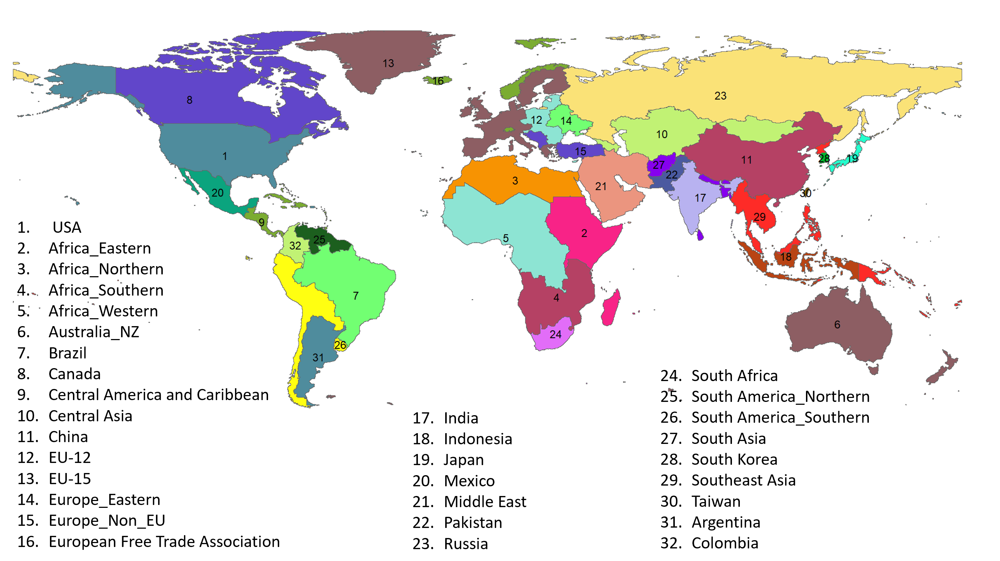

```{r setup, echo = FALSE, message=FALSE, warning=FALSE}
knitr::opts_chunk$set(results = "hide", echo = FALSE, out.width = "75%", fig.align = 'center',
                     message = FALSE, warning = FALSE, error = FALSE, eval = TRUE,
                     fig.cap = "center", kable.styling = "bootstrap",
                     kable.table.attr = "style='margin-left: auto; margin-right: auto;'",
                     rmarkdown.html_vignette.check_title = FALSE)
```

<!-------------------------->
<!-------------------------->
# Introduction
<!-------------------------->
<!-------------------------->
<p align="center"> </p>

This page is a compilation of various GCAM versions that have some kind of regional breakout. Different institutions maintain these versions. We have divided them into 4 different sections.

1. **Core 32:** The core 32 GCAM regions
2. **National:** GCAM versions in which additional countries have been broken out or existing regions have been enhanced.
3. **Subregional:** GCAM regions or countries which are broken into sub-national regions such as provinces or states

<div class="warning" style='background-color:#fffae0; border-left: solid #1f1f1f 4px; border-radius: 4px; padding:0.7em;'>
<span>
<p style='margin-left:1em;'>
If you have built or want to build and maintain your own version of GCAM for a country or countries not yet represented in the core version of GCAM please post an [issue](https://github.com/JGCRI/gcambreakout/issues) on our github page and let us know so we can add you to the list below or help you out with any issues.
</p>
</span>
</div>

<br><br>

<!-------------------------->
<!-------------------------->
# Core 32
<!-------------------------->
<!-------------------------->
<p align="center"> </p>

The figure below shows the core 32 regions in GCAM:



<br><br>

<!-------------------------->
<!-------------------------->
# National Models
<!-------------------------->
<!-------------------------->
<p align="center"> </p>

The table belows shows the versions of GCAM with new or enhanced regions along with the POC and institution at which it is hosted.

<p style='text-align: center;'><strong><u>National Breakouts</u></strong></p>

```{r, results = 'show', eval=TRUE, echo=FALSE, warning=FALSE, error = FALSE, message = FALSE}
library(kableExtra); library(dplyr)

data.frame(
  name = c('GCAM-KSA', 'GCAM-Australia', 'GCAM-Chile', 'GCAM-Korea', 'GCAM-CCDR', 'GCAM-EU'),
  gcam_version = c('v6.0', 'v6.0', 'v6.0', '?','v5.4','v6.0'),
  new_regions = c("Saudia Arabia", 'Australia', 'Chile', 'South Korea (Enhanced)',
                  'Multiple (Azerbaijan, Paraguay, Angola, Burkina Faso, Chad, Mali, Madagascar, Mauritania, Ghana, Cambodia, Democratic Republic of the Congo, Republic of Congo, Guinea-Bissau, Liberia, Ivory Coast)', 
                  'Bulgaria, Croatia, Cyprus, Czech Republic, Estonia, Hungary, Lithuania, Latvia, Malta, Poland, Romania, Slovakia, Slovenia, Austria, Belgium, Germany, Denmark, Spain, Finland, France, United Kingdom, Greece, Ireland, Italy, Luxembourg, Netherlands, Portugal, Sweden, Switzerland, Iceland, Norway'),
  POC = c("Puneet Kamboj - puneet.kamboj@kapsarc.org", "Yeliz Simsek - yeliz.simsek@anu.edu.au", "Paelina DeStephano - paelina.destephano@pnnl.gov", 'Suduk Kim - suduk@ajou.ac.kr',
          "Silvia Regina Santos Da Silva - ssantosd@gmu.edu", "Jon Sampedro - jon.sampedro@bc3research.org, Dirk Jan Van de Ven - dj.vandeven@bc3research.org"),
  Insitution = c("KAPSARC", "Australian National University", "PNNL", "Ajou University",
                 "George Mason University", "BC3"),
  Link = c("https://github.com/KAPSARC/gcam-ksa", "None", "None", "None", 
           "None", "None")) %>% 
  kbl() %>%
  kable_styling(bootstrap_options = c("bordered","striped", "hover", "condensed", "responsive"), position="center", full_width = T) %>%
  row_spec(0, background = "#2A2A2A", color = "white") %>%
  row_spec(0,align="c")
```


<br><br>

<!-------------------------->
<!-------------------------->
# Subregional Models
<!-------------------------->
<!-------------------------->
<p align="center"> </p>

The table belows shows the versions of GCAM with subregions along with the POC and institution at which it is hosted.

<p style='text-align: center;'><strong><u>Subregional Breakouts</u></strong></p>

<p align="center">
```{r, results = 'show', eval=TRUE, echo=FALSE, warning=FALSE, error = FALSE, message = FALSE}
library(kableExtra); library(dplyr)

data.frame(
  name = c('GCAM-USA', 'GCAM-China', 'GCAM-India'),
  gcam_version = c('core','?', '?'),
  new_subregions = c("50 states + DC", "Provinces", "States"),
  POC = c("Matthew Binsted - matthew.binsed@pnnl.gov, Gokul Iyer - gokul.iyer@pnnl.gov", "Qian Zhang - qiangzhang@tsinghua.edu.cn", "Vaibhav Chaturvedi - vaibhav.chaturvedi@ceew.in" ),
  Insitution = c("PNNL", "Tsinghua University", "Council on Energy, Environment and Water (CEEW)"),
  Link = c("https://github.com/JGCRI/gcam-core","None","None")) %>% 
  kbl() %>%
  kable_styling(bootstrap_options = c("bordered","striped", "hover", "condensed", "responsive"), position="center", full_width = T) %>%
  row_spec(0, background = "#2A2A2A", color = "white") %>%
  row_spec(0,align="c")
```
</p>

<br><br>
